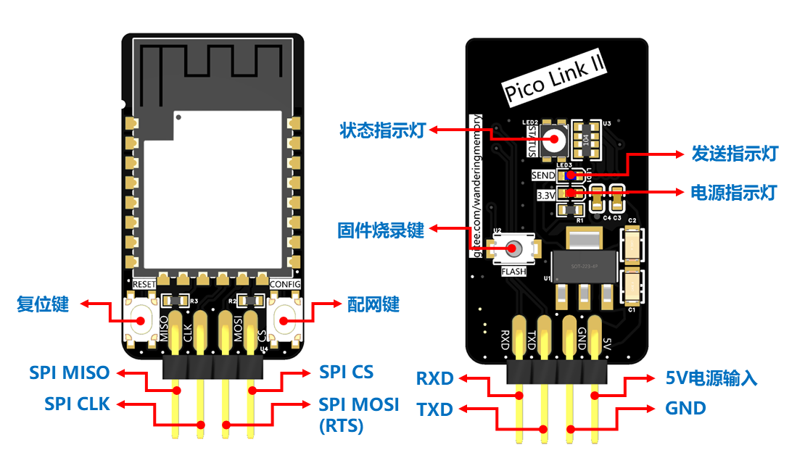
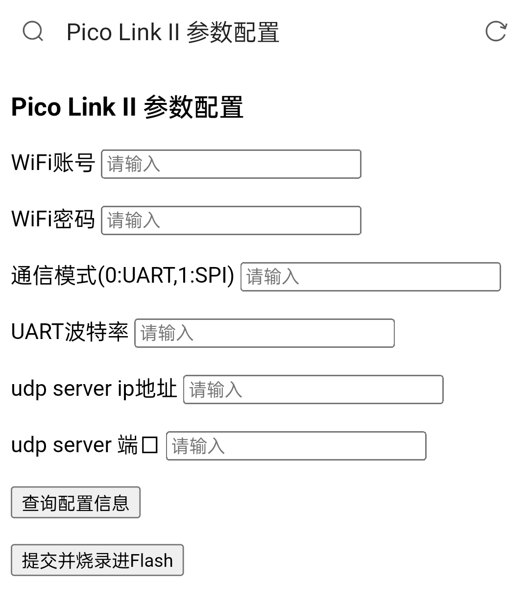
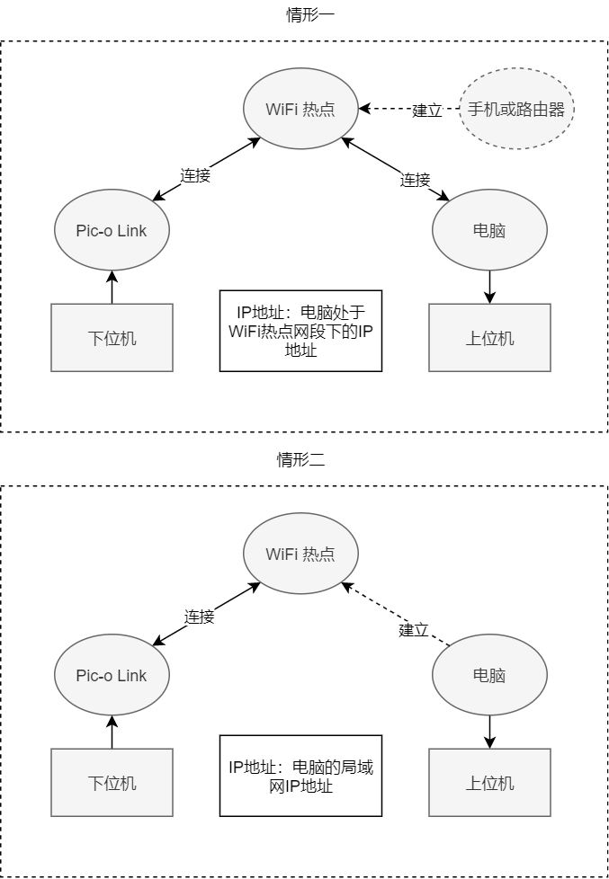
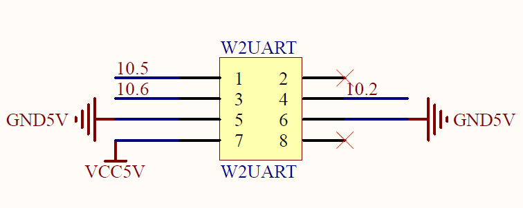

# 基于 ESP32-C3 的多协议 WiFi 透传模块

> 本项目为基于乐鑫公司的 ESP32-C3 芯片制作的无线透传模块，具有多个通信协议接口：UART、SPI。设计初衷是为了方便全国大学生智能汽车竞赛的摄像头算法调试，通过和上位机配合降低调试难度
>
> esp32-c3 硬件支持 5Mbps UART 和 60Mbps SPI slave

该模块兼容逐飞科技的无线串口接口，具有硬件流控功能，**仅支持单向透传到上位机**

本人QQ：1626632460，模块QQ交流群：613773009

B 站视频：https://www.bilibili.com/video/BV1Uo4y1i7Jo

该模块可搭配开源致用上位机 https://gitee.com/zhou-wenqi/ipc-for-car 使用，该仓库里有例程

该模块也可搭配 GY 上位机（付费）使用，**模块成品及 GY 上位机已上架淘宝店铺——左家垅的牛**

## ⭐和一代比较⭐

一代见 https://gitee.com/wanderingmemory/pic-o_link

|     模块名称      |     pic-o link     |           pico link II           |
| :---------------: | :----------------: | :------------------------------: |
|       主控        |       esp32        |           **esp32-c3**           |
|  最大 UART 速率   |       5Mbps        |              5Mbps               |
| UART 是否支持流控 |        支持        |               支持               |
|   最大 SPI 速率   |       10Mbps       |            **60Mbps**            |
|     空中速率      |       30Mbps       |              30Mbps              |
|     配置方式      |    串口+上位机     |           **WEB 配置**           |
|   UART 通信协议   |        定长        |            **不定长**            |
| 支持的 WiFi 频率  |       2.4Ghz       |              2.4Ghz              |
| 与上位机通信方式  |        UDP         |               UDP                |
|      指示灯       | 电源指示、状态指示 | **电源指示、状态指示、发送指示** |
|     供电电压      |         5V         |                5V                |

## 项目结构

|   名称   |               作用               |
| :------: | :------------------------------: |
|   doc    |             芯片文档             |
|  driver  | 驱动文件（致用上位机、GY上位机） |
| firmware |             固件工程             |
| hardware |   硬件（Gerber、原理图、BOM）    |
| software |    简易 python 图传上位机脚本    |
|  image   |               图片               |

## 模块资源



**状态指示灯**

- 红：没连上 WiFi
- 蓝：连上 WiFi
- 绿：配网模式

**发送指示灯**

亮了则代表模块正在往上位机发送数据

## ⭐串口不定长传输协议⭐

串口支持最大**5Mbps**传输速率，一次最多接收**25000**字节

**二代从固件层面修改了串口传输协议**，简单来说，必须在向模块发送数据前先发送2个字节（小端模式）告知模块接下来要传输的数据流长度，然后传输数据。这2个字节组成了一个16位的无符号整型数被模块解析从而知道数据长度

具体来说，由于 UART 是异步通信，接收端并不知道何时传输会结束，往往会设置一个参数 delay，当超过这个 delay 的时间其还没有收到信息则将之前收到的所有数据当成一次传输。所以正常传输时发送方发完后，接收方会等待 delay 的时间然后才会把数据整合。然后还有一个参数则是接收到多少字节后视作一次传输，不定长传输协议则是先向模块发送两个字节的数据（小端模式）通知接下来传输的数据长度，然后发送实际数据即可实现无 delay 的传输

驱动伪代码示例：

```c
char str = "hello world!";
uint16 len = (uint16)(strlen(str));
UART_SEND_BYTES((uint8 *)(&len), 2); // 小端模式通知发送长度
UART_SEND_BYTES((uint8 *)(str), (uint32)(len)); // 发送数据
```

## ⭐SPI 协议⭐

SPI 支持最大**60Mbps**传输速率，一次最多接收**30000**字节

只支持**4字节倍数长度**的数据接收，SPI 模式为**3**，即 CPHA = 1, CPOL = 1

驱动伪代码示例：

```c
uint8 sendBuffer[BUFFER_SIZE] = {0}; // 发送缓冲区
char str = "hello world!";
uint32 len = (uint32)(strlen(str));
uint32 overLen = 4 - len % 4; // 补齐为4字节倍数需要的字节数
memcpy((sendBuffer + 0), str, len); // 复制到缓冲区
memset((sendBuffer + len), '\0', overLen); // 补齐为4字节倍数
SPI_SEND_BYTES(sendBuffer, len + overLen); // 发送数据
```

## ⭐配网模式⭐

上电，先按住 `CONFIG` 键不放，再按一下 `RESET` 键，等待状态指示灯变绿

手机或电脑打开 WiFi 搜索 `Pico Link II`，密码：`88888888`

连接成功后，打开浏览器地址栏输入 `192.168.4.1` 访问即可进入配网界面，配置好参数后按复位键复位，模块会把新配置的参数写进 Flash，掉电不丢失



## 模块工作流程

1. nvs flash 初始化
2. 加载 Flash 配置参数
3. 检测是否进入配置模式
4. 根据配置参数进入通信模式
5. 设置为 WiFi STA 模式
6. WiFI 硬件初始化成功开始扫描 WiFi，指示灯显示当前状态 -> **红**
7. WiFi 连接成功，设置为 udp client 模式指示灯显示当前状态 -> **蓝**
8. 等待下位机传输数据，下位机传输完数据后，模块开始通过 WiFi udp 向上位机 udp server 发送数据，发送指示灯亮
9. 回到 8

## 软件

简易 python 图传上位机脚本，带帧头帧尾检测，协议类似于致用上位机

运行需要的 python 库：

- numpy
- opencv-python

## ⭐常见问题⭐

**和下位机如何连线？**

- **UART**

  |      模块       |                        下位机                         |
  | :-------------: | :---------------------------------------------------: |
  |       RXD       |                          TXD                          |
  |       TXD       |                          RXD                          |
  | RTS (复用 MOSI) | CTS（没有接的话要在下位机串口传输函数里禁掉流控检测） |

- **SPI**

  | 模块 | 下位机 |
  | :--: | :----: |
  | CLK  |  CLK   |
  | MISO |  MISO  |
  | MOSI |  MOSI  |
  |  CS  |   CS   |

- **5V 供电，地线必接**

**如何计算传完一张图像所用的时间？**

以 UART 3Mbps 传输 60 x 90 灰度图为例，首先计算图像的位数：60 x 90 x 8 = 43200 bits，再用位数除以波特率：43200 / 3000000  = 0.0144 s = 14.4 ms

**具体配置哪个 IP 地址？**

以下两种情形指示了模块配置的 IP 地址参数：



**接口及PCB绘制要求**？

- 接口：2.54mm 2x4p 排母
- 5V 电源至少要保证 500mA 的输出电流

UART 模式以 TC264 为例（参考逐飞无线串口接口原理图，可直接照搬，注意相比一般的 UART 接口额外需要一个流控引脚，可以模仿逐飞无线串口发送驱动用一个 GPIO 作为输入模式来模拟）



## DIY 看这里

**如何打开固件工程？**

`VS code` 安装 `PlatformIO IDE` 插件，然后右键固件文件夹选择 `通过 Code 打开`，打开后等待一段时间，插件会自动安装好依赖和编译工具链


**如何烧录固件？**

电脑使用 USB 转 TTL 串口助手连接模块 `TXD` 脚和 `RXD` 脚 ，按住模块 `FLASH` 键不放再按一下 `RESET` 键，然后点击 `PlatformIO IDE` 底部的如红框所示按键一键编译下载，下载完毕后按 `RESET` 键复位


**如何修改模块的主机名？**

修改 `sdkconfig.esp32-c3-devkitm-1` 文件的 `CONFIG_LWIP_LOCAL_HOSTNAME` 项再重新编译烧录固件

**如何修改配置模式时 WiFi AP 的账号密码？**

修改 `src\wifi_ap.c` 文件中 `ESP_WIFI_SSID` 和 `ESP_WIFI_PASS` 项再重新编译烧录固件

